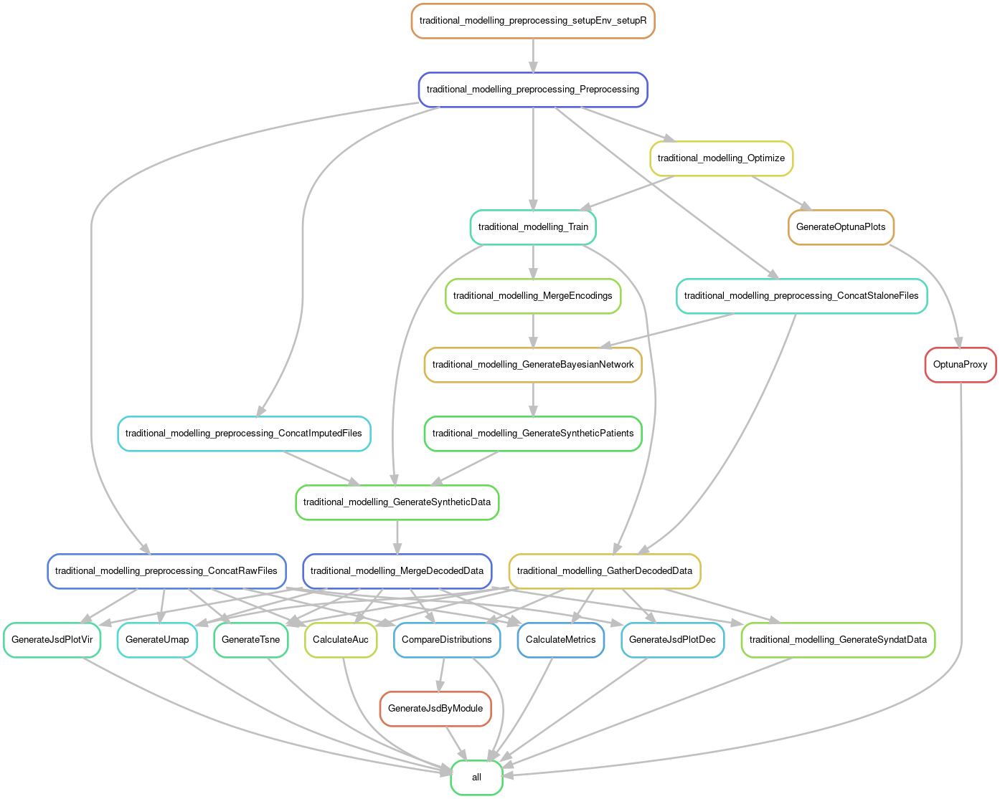
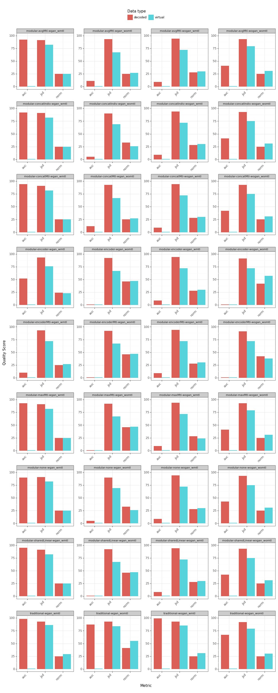
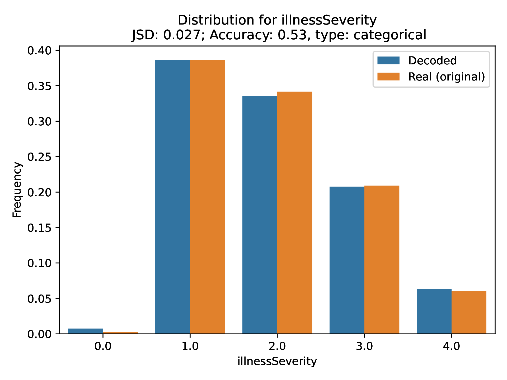
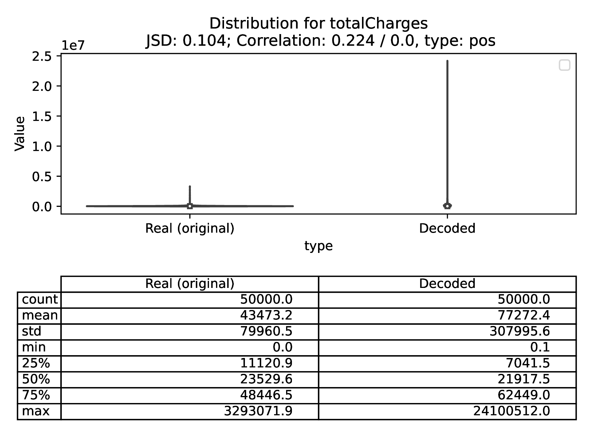
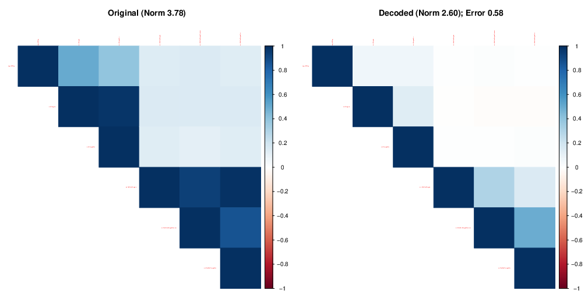
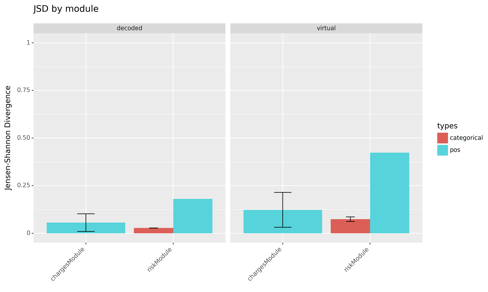
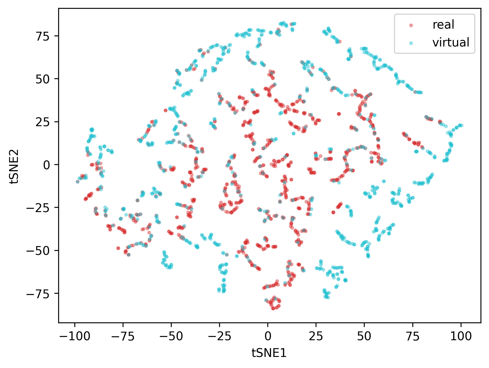

# Example Application of VAMBN on the Texas Dataset

## Setup

Follow the instructions in the [Setup section](setup.md) to set up the environment for this example.

## Preparing the Data

For this example, we use the freely available Texas dataset. The dataset is available in the [arx-deidentifier repository](https://github.com/arx-deidentifier/arx/blob/shadow/data/texas.csv). Full data and column descriptions are available at the [Hospital Discharge Data Public Use Data File webpage](https://www.dshs.texas.gov/THCIC/Hospitals/Download.shtm). You can download the file directly with the following command in Linux/MacOS:

```bash
wget -P data/raw https://github.com/arx-deidentifier/arx/raw/shadow/data/texas.csv
```

If you are using Windows, follow these steps to download the Texas dataset:

1. Open your preferred web browser and go to the [arx-deidentifier repository](https://github.com/arx-deidentifier/arx/blob/shadow/data/texas.csv) on GitHub.
2. Click on the "Download" button to download the dataset.
3. Once the download is complete, locate the downloaded file (texas.csv) on your computer.
4. Move the file to the `data/raw/` directory in your project.

Next, convert the data to the correct input format using the [conversion script](notebooks/convert_texas.py) available in the `notebooks/` directory of the project.

```bash
# Convert the data to the correct format
python notebooks/convert_texas.py data/raw/texas.csv data/raw/input_texas.csv
```

In addition to the converted data, you will find several files in the `data/raw/` directory:

- `grouping_texas.csv`: Specifies the grouping of features into different modules, including module names, feature names, and feature types.
- `groups_texas.csv`: Lists the module names to be used.
- `blacklist_texas.csv`: Specifies features that should not be used in the Bayesian Network.
- `whitelist_texas.csv`: Specifies features that should be used in the Bayesian Network.
- `startDag_texas.csv`: Specifies the initial structure of the Bayesian Network.

These files are used as inputs to the VAMBN pipeline. The sections below describe the details of these files.

### Input File

The input file should contain a `SUBJID` column with the sample IDs and a `VISIT` column. For longitudinal data, encode visits from 1 to N based on their order. For static data, add a `VISIT` column with all values set to 1. Besides these two columns, include only the features specified in the grouping file.

*Hint: Refer to the generated input_texas.csv file if you are unsure.*

### Grouping File

The grouping file defines which features are encoded together by the HIVAE model. It should contain the following columns:

| column_names | technical_group_name | hivae_types |
| :----------: | :------------------: | :---------: |
|     MMSE     |       stalone        |     pos     |
|  Measure A   |       moduleA        |    real     |
|  Measure B   |       moduleA        | categorical |
|  Measure C   |       moduleB        |    count    |
|  Measure D   |       moduleB        |   ordinal   |

The `column_names` should match the columns in the input file. The `technical_group_name` can be any string consisting of letters and numbers ([a-zA-Z0-9]) without spaces or underscores. The `hivae_types` can be real, pos, categorical, count, or ordinal. For more details, refer to the [original paper](https://arxiv.org/abs/1807.03653).

Features that **start with stalone_** appear in the Bayesian Network without being encoded/imputed by the HIVAE. Mean imputation is applied for continuous data, and mode imputation is used for the rest.

### Groups File

Typically, this file contains the technical group names. To restrict your pipeline to specific modules, list them as shown below:

```plaintext
moduleA
```

or

```plaintext
moduleA
moduleB
```

### Bayesian Network-Related Files

These files depend on your specific use case and any possible restrictions. The structure is as follows:

```csv
from,to,
moduleA,moduleB,
MMSE,moduleA,
```

## The VAMBN Pipeline

VAMBN 2.0 aims for simplicity by using Snakemake. Refer to their [documentation](https://snakemake.readthedocs.io/en/stable/) for more details. Provide the required input files, and Snakemake will handle the rest. The diagram below shows the execution order of rules, here only for the
traditional part of the pipeline to keep it simple.



The pipeline consists of several stages:

1. Setup: Installing R dependencies.
2. Data Preprocessing: Preparing the data for subsequent rules.
3. Optimization and Final Fitting: Training HIVAE models using either a traditional or modular approach.
    - Traditional: One HIVAE is trained for each data module individually.
    - Modular: A single model with different Encoders and Decoders connected via a shared layer.
4. Bayesian Network Learning: Learning the network structure and generating plots.
5. Generation of Synthetic Data: Generating synthetic data using the BN and the HIVAE models.
6. Postprocessing: Calculating quality metrics and generating plots.

### Pipeline Configuration

The pipeline configuration is handled by the `vambn_config.yml` file. Refer to the [configuration documentation](configuration.md) to learn about the different parameters and modify the config file according to your needs.

### Pipeline Execution

To run the entire pipeline, execute the following commands:

```bash
poetry shell
# Execute the entire pipeline
snakemake -c<numberOfCores>

# Dry run to check the rules and outputs
snakemake -c<numberOfCores> -n
```

To run only a specific Snakemake module, use the following commands:

```bash
poetry shell
snakemake -s snakemake_modules/modular-postprocessing.snakefile -c<numberOfCores>

# To generate a predefined output
snakemake -s snakemake_modules/modular-postprocessing.snakefile -c4 reports/optimization/result_file
```

For more information on Snakemake, refer to their documentation.

#### Special Case: Running Snakemake on SLURM-Based Clusters

To execute jobs on a SLURM cluster, create a Snakemake profile for SLURM. If `cookiecutter` is not installed, install it using `pip install cookiecutter` or `poetry add cookiecutter`. Then, run the following commands:

```bash
# Create a config directory for Snakemake profiles (or use another location)
profile_dir="${HOME}/.config/snakemake"
mkdir -p "$profile_dir"
# Use cookiecutter to create the profile in the config directory
template="gh:Snakemake-Profiles/slurm"
cookiecutter --output-dir "$profile_dir" "$template"
```

Check `${HOME}/.config/snakemake/slurm` and modify the profile if needed.

Once configured, run the Snakemake pipeline with the following command:

```bash
snakemake --profile=${HOME}/.config/snakemake/slurm --jobs=<numberOfJobs>
```

Refer to the [Snakemake documentation](https://snakemake.readthedocs.io/en/stable/executing/cluster.html) for more details.

## Results

Once the entire pipeline is executed, you will find various figures and tables in the `reports/` directory. It's important to note that the depicted results are generated for the Texas dataset with reduced epochs and trials for demonstration purposes only. Consequently, some results may not be as expected.

### Example Figures



This file shows the scores for all experiments that were run. The title of each subfigure describes the model approach (modular vs. traditional), potentially the shared element that was assessed, if the GAN variant was used (wgan vs. wogan), and if multi-task learning was applied (wmtl vs. womtl).

- **AUC Metric:** Calculated by training Random Forests to distinguish between the real and decoded or synthetic data. Ideally, the AUC should be close to 0.5, indicating that the Random Forests cannot distinguish between the two datasets. The depicted metric is a quality score ranging between 0 and 100, where 100 is the best possible score.
- **Jensen-Shannon Distance (JSD):** A measure of the similarity between the real and decoded or synthetic data. A value of 0 indicates that the two datasets are identical. The depicted quality score inverts the JSD, so a value of 100 indicates identical datasets.
- **Norm-metric:** Measures how well the correlation structure of the real data is preserved in the decoded or synthetic data. A value of 100 indicates perfect preservation of the correlation structure.

### Additional Visualizations

- **Feature Distribution:**





- **Correlation Structure:**
  The correlation structure of the real data can be compared to the correlation structure of the decoded data.
  

- **JSD by Module:**
  The real JSD (not a quality score) can be visualized per module. Each feature is depicted as a dot in the plot, where the x-axis represents different modules. This plot helps identify features that are not well preserved in the decoded data.
  

- **tSNE Plots:**
  Shows how close the real and decoded data are in the latent space.
  

### Additional Content

In the `reports/` directory, you will also find tables, the Bayesian Network (BN) output, and other relevant data outputs that provide deeper insights into the experiment results. If you have any questions, feel free to reach out to the authors.
